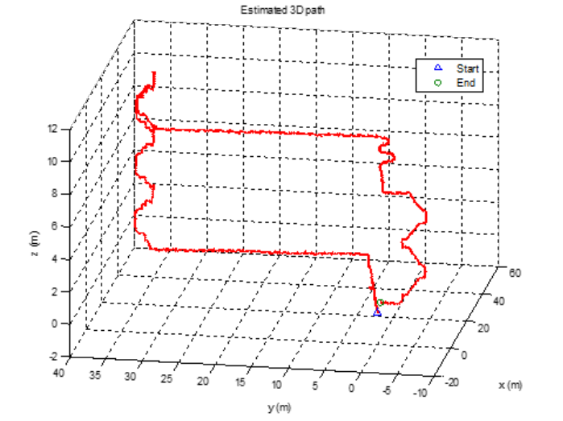

# Final Report

# Table of Contents
* Abstract
* [Introduction](#1-introduction)
* [Related Work](#2-related-work)
* [Technical Approach](#3-technical-approach)
* [Evaluation and Results](#4-evaluation-and-results)
* [Discussion and Conclusions](#5-discussion-and-conclusions)
* [References](#6-references)

# Abstract

As the number of smart devices in a household continues to grow there is need for a system to distinguish and control said devices. The goal of this project is develop as system on top of the sensors available in current smartphones to allow a user to interact with multiple smart devices indoors. Current smartphones are equipped with both IMU sensing and UWB ranging, by leveraging these sensors we have created a system to introduce two UWB anchors in a known space to facilitate localization in said space. Then, by combining the location estimate with the IMU data for where the user is pointing their smartphone a smart device in a room can be selected. After this selection is made the user can control the smart device and the stimulus is broadcasted over BLE.

  

# 1. Introduction

## Motivation & Objective

Current estimates expect the number of IoT devices to hit 30 Billion by 2025 with continous exponential growth[1]. With the growth of avaiable devices, the number of smart devices that each user has to manage also continues to grow. This increase in devices per user, makes it continuously harder for users to manage and control their devices in an intuitive way. The goal of the project is to create a localization and orientation technique for detecting and controlling smart device objects in a room via pointer control using only the sensors available in smartphones today. The project aims at accomplishing this with the least amount of additional sensors as possible.
 
## Todays Limitations

Most localization techniques used today include GPS, bluetooth, or Wi-fi ranging. The localizations techniques have accuracies in the range of 1-5m and so are generally not considered to be precise enough to distinguish interactions in a typical home setting. Additionally these techniques each have ranging capabilities which also can have limitations such as not being in a building with cement walls for GPS and being within close proximity for BLE and Wifi. UWB ranging techniques on the other hand offers localization accuracies within +/-20cm per anchor tag pair. This localization precision is required for accurate indoor user interation tracking. 

# Novelty, Rationale, and Impact: 

This project is novel because it present a feasable method for intuitively managing smart devices, and provides a novel approach localization techniques using UWB and IMU data that could stretch beyond the intended use case. 
JAMes Note:This was 3 sections combined into one, I dont know what else to add to this
# Challenges: 
- using as few UWB anchors as possible while still providing accurate location data
- succesfully proceesing IMU data to understand movements of humans while being able to filter out drift
- accuratly fusing orientation and position to make predictions about intended line of sight object selections

# Requirements for Success: 
- Create a "Smart Controller" with IMU and UWB sensor to ESP32 microcontroller to be used to test accuracies.
- Tune UWB tag and initiator antennas to offer accurate measurements
- Filter UWB position etimates to allow for continous/not noisy readings
- Create GUI which illustrates position of objects in the room and the guesses of which object the device is interacting
- Demonstrate the use of a controller on a smart object

# Metrics of Success: 
- Positional Accuracy (x, y, z)
- Orientation Accuracy (Alpha, Beta, Gamma)
- Cost and number of sensors needed to perform localization
- Ability of controller to distinguish between multiple objects in a room

# 2. Related Work
Indoor localiztion is a very wider area of research that this project builds upon. Two specific techniques for indoor localization that are used in this project are UWB indoor localiztion and IMU localization.

UWB Indoor Localization
In a paper by Zwirello et al. [CITE] indoor localization using UWB is done by rigging a space with many anchors and ranging to a tag somewhere in the space. This group analyzed both the optimal locations for placing UWB in a space as well as the optimal algorithms for converting the ranging data into an absolute position. The following figure shows an example scheme of anchors in a cube space.

  

The goal of this group was to find and optimal positioning algorithm that could use many anchors to find very precise location. For systems using few UWB anchors they found that the optimal approach is to simple estimate the location of the tag as somewhere on the surface of a sphere centered at each anchor with a radius equal to the range measurment. For a 3-D space, 4 anchors are need to pinpoint the location of a tag to one point. As this project uses a maximum of 2 anchors, the best estimate is somewhere on a circle that is the intersection of 2 spheres. A representation of this intersection is shown in the figure below.

  

IMU Indoor Localization
In a paper by Ibrahim et al. [CITE] indoor localization was achieved using a 9-DOF IMU sensor and a barometric pressure sensor. The basis of the system was to find the derivative of the acceleration to obtain the jerk and then take the triple integration to determine displacement. This is done in an attempt to reduce the effects of sensor drift on the overall measurements. The pressure measurement was used to estimate the height by making assumptions about how atmospheric pressure decreases as height increases. They then passed these measurements through a Kalman filter to find the displacement estimates and were able to track a walk through a multi-story building withing 3% error. The graph of this experiment is shown in the figure below.

  

This data is very impressive and lends some support to the feasibility of doing human localiztion with IMU data but it relied on several crucial assumptions. The assumptions made by this group was that the subject have the IMU sensor attached at the belt and that the subject always be moving forward. For this project, the user must be allowed to wave their smartphone around the room to point at smart devices and so the assumption of having the IMU be fixed on the body was simply not feasible. Allowing the user to wave the smartphone around introduces far too much noise in the reading the come up with any useful data to predict position from the IMU data.
# 3. Technical Approach

## Hardware

  

- BN055 9-axis IMU
- ESP32 Wrover
- Qorvo DWM300 (1 Initiator, 1 Tag)

This hardware was then put together on a breadboard which had a push button and green LED to represent a controller which would be replaced by a phone and interactable controls screen in the future. The button was used to calibrate the controller to indicate when it was aligned with the room, and to interacte/toggle the smart lights that were used during testing.

  <figure>
    
    <figcaption align='center'>UWB + IMU "smart Controller"</figcaption>
  </figure>

## Sensor Fusion Approach

  <figure>
    
    <figcaption align='center'>Methods to Detect Orientation and Pose Estimations</figcaption>
  </figure>

To achieve accurate detection of where a user is pointing a controller in free space, the two measurements that are needed are orientation estimation (Alpha, Beta, Gamma), and pose estimation (x, y, z). 

To obtain an oreintation estimation the 9 axis IMU was used. There are two ways that a 9 axis IMU can detect orientation. The first method is by sensing where the magnetic fields point with the magnetometer and where gravity acceleration is pointing with the accelerometer, and by taking the cross product of theses two vectors we can get orientation. The second method is if we know the original orientation and the gyroscope is working perfectly, the angular rotation multiplied by time will tell us the orientation of an object. The BN055 IMU and built in Arm Cortex M0 microprocessor provides cutom software to fuse these two estimations together to make a fused orientation estimate which can be update at 100Hz.  

To obtain a pose estimation, the goal of the project was to use the orientation estimation and fuse it with IMU and UWB measurements to get X, Y an Z cordinates. In theory there are two methods to get position with this approach. The first is if you know relative orientation of the controller to the room you are in, you can perform a tranformational rotation on the acceleration sensors to get relative x, y, and z positional accelerations.

  <figure>
    
    <figcaption align='center'>Arduino Rotation Matrix Calculation</figcaption>
  </figure>

By using the above translated accelerations, you can integrate acceleration to get velocity, and integrate velocity to get position. The biggest limiting factor with this approach is that the acceleromter is prone to drift and since position is a result of a double integrataion, positional error can be accumulated over time. The second method that was initially used to estimate position was using one UWB anchor and tag, where the initial anchor position in the room was known. By having one tag in the room and getting a distance measurment from the UWB, the anchor creates a sphere of possible positions that the tag could be in relation to the anchor. The idea was that over time if we combined both positional observation from the acceleration and distance observations from the UWB anchor, the possible locations where a user is could be reduced overtime be able to conclude the user could only be in one possible spot.

# 4. Evaluation and Results

# Accelerometer Position Estimation Evaluation

To test the accuracies of accelerometer readings, a stationary IMU test was performed. This test involved placing the designed controller flat on a surface and averaging the first 30 samples of the stationary controller to get acceleration offsets. Once offsets were calculated, the sampling began where the controller would read the accelerometer readings minus the offsets. In a perfect world, the readings would show zero acceleration, however as expected there was drift. When the accelerations were integrated into velocity, and the velocities were integrated into position, the stationary test showed that soley relying on the acceleration data would have predicted 30m error in the x position, 600m off in the y position, and 40m off in the z direction. 

  <figure>
    
    <figcaption align='center'>Stationary Test Accelerometer Position Estimation over 3 minutes</figcaption>
  </figure>

# IMU Orientation Estimation Evaluation

To test the accuracies of the Alpha, Beta, and Gamma values provided by the IMU fusion sensor, a stationary angle test was performed for each respective angle. For each test, the user would move around the controller for five seconds, then place the controller at the repective angle stationary for 5 seconds before an angle sample was taken. In total, 6 Alpha angles (0-360°), 9 Beta angles (-90, 90°), and 7 Gamma angles (-180, 180°) were tested, with ten samples tested per angle. The respective mean errors were calculated to be +/-37.27° for Alpha, +/-5.97° for Beta, and +/-4.26° for Gamma. One significant observation is that the angle that has the most significant error (Alpha) is also the angle that is likely most impotant when diferentiating objects in the room as it governs both the x and y pointing position for a line of sight when pointing in a room. Though the Gamma angle orientation is not used for determing where the line of sight is pointing for the controller, it is important when translations on the raw accelerometer values are made to get position estimations.

  <figure>
    
    <figcaption align='center'>True Angle Versus Angle Estimation</figcaption>
  </figure>

  <figure>
    
    <figcaption align='center'>Average Angle Error for Alpha, Beta, Gamma angles</figcaption>
  </figure>

# Updated Postion approach

After discovering the significant noise that was present on the accelerometers, the next approach was to try and filter the accelerometer noise. A bandpass filter was added to the accelerometer to filter the data of interest. Thr high pass frequency was meant to filter out the drift and errors that were caused by inaccuracies from the transformations/orintation estimations and the low pass filter meant to filter out the noise in the accelerometers. The first step was to see if we could get indications of the direction that the controller was moving in a point in time, assuming that the object was at zero velocity. We were able to get gerneral direction indiciations based on seeing accelerometer turning iniitially positive in one direction and the negative shortly after when the object deaccelerated. Anytime that this data was integrated however, the data would inconsistantly accumulate velocity values to the point where often times the velocity would indicate that object was moving quickly in the reverse direction. Additionally, when the controller was tested not moving parrallel to one of the accelerometer axis, the transformations that were applied to get direction had significant error that was accumulated. This was due to incorrect angle transformations and since gravitational acceleration was so significant it showed up in all directions and it rendered any non parrallel axis movement useless for giving information about directional movements. It was then decided that the nature of the accelerometer and its inaccuracies paired with the IMU sensor inaccuracies in orientation estimation made it not ccapable of being used for for position estimation.

The next direction taken to achieve accurate position estimation without using IMU data was moving from one UWB anchor to two. Though two tags are not normally enough to calculate position in 3d space, two tricks were applied to estimate position.

### Trick One

After using the controller in a experiment setting, one observation was that most of the time when the controller was being used, it would be held at the same or similar heights by the user with the height being based on the user. If we make the assumption that the user will be using the controller at similar Z plane heights, this siginificantly reduces the possibity of where the user could be located. Using some geometry techniques we can see that the intersection of a plane (z plane height) and a sphere reduces potential location of a user from a sphere to a circle.

  <figure>
    
    <figcaption align='center'>Trick 1: Assme user fixed height (Interection of plane and a sphere)</figcaption>
  </figure>

### Trick Two
The next idea was to reduce the possible locations of the intersection of two circles from after applying trick 1. One initial idea was if we know the initial location, you can make assumtions about which of the two possible solutions in the circle intersects that the user would be in based on the fact that the user cannot just jump around between readings and so taking the closer solution to the previous solution. Though this may work, if the two intersections are close and the controller gets off then the estimations would quickly become bery incorrect. 

The final idea used was to strategically plave the anchors. If we are assume we are in a rectangular room and place on tag in the corner and another along on of the neighboring walls, we cut off the solutions of the circle intersects of the room down to one possible loation. This id due to fact that 3/4 of the circle is removed by the walls for the ancor placed in the corner and the 1/2 of the circle is removed by the walls for the anchor placed along the wall. This geometry reduction allows us to have only one point in the room where the user could be based on two tag readings. 

  <figure>
    
    <figcaption align='center'>Trick 2: Strategic Anchor placement (Room circle intersects)</figcaption>
  </figure>

# UWB Position Estimation Evaluation
In oder to get accurate antennas readings for the UWB, each anchor antenna had to be tuned. Since the distance cacluclation includes both ToF and internal anchor delays, the anchor delay for each antenna had to be tested. To do this, the anchor antennas were placed at known distance locations and the relative time/distance calculations were made based off assumptions of various  offsets. The delay was calculated by integrating the errors for each offset. After tuning the antennas, the UWB measurements were still noisy and inconsistantly/not reading within the specified +/- 30cm accuracy of the devices. To reduce the noise, a 10 sample 10Hz moving average filter was applied and UWB measurements were then able to fall within the specified accuracies.
# Line of Sight Object Detection

To detect where a user was intending to point, the position estimation and the orientation estimation were used. If all poisitions of the smart devices are known, then by knowing position and orientation of the controller we can imagine a line coming out of the top of the controller where the user is pointing. To determine which object the user is intending to select, we designed a virtual 1 m sphere radius where if the pointinh line crossed any where in that sphere it would be considered to be detected and pointed at. If there was multiple object intersections, than to distinguish which item the user is pointing at, the closest distance from the line to the center point of the object was calculated, and which ever object was closer would be "selected" and could be controlled by the device.

# GUI 

To allow for visual represenation of the position, orentation, and object selection of the device, a python GUI was created. This GUI displays how the controller is estimated to poistioned including the direction it is pointing (shown by the compass) and the tilt of the controller (shown by the tilt lines). It also renders the estimated user x and y positions in the room, the dimensions of the room, and displays the objects in the room (with configureable click placement). Finally, when an object is pointed at and the line of sight calculation detects selection,that object is rendered and can be controlled in the bottom right corner.

#James insert Orientation video here!!!!!!!!!!!!!!!!

When an object pointed at and the button on the controller is clicked, an illustration highlights the line of sight of the controller along with the device that was chosen. For proof of concept smart lights were added and would toggle upon button selection if chosen.

  

  Image of GUI with user selecting/controlling bluetooth speaker

##Insert videos depicting controller use here

      

      

# 5. Discussion and Conclusions

With the 2 UWB anchor approach, the system was successfully able to select and control multiple smart devices in the room.

In order to achieve the original goal of creating a system that uses only one UWB anchor and the IMU sensor data more assumptions would need to made. The data shows that with no limit on the position of the IMU sensor on a human subject, there is far too much noise to draw any conclusions about the displacement at any given time. It is possible that some sophisticated denoising algorithm or deep learning approach would have allowed us to find some significance to the IMU data. However, problem of localizing with a freely moving IMU sensor by itself is a research topic of its own.

Overall, we were satisfied with the ability of the system to detect smart devices as they were pointed to in a room. Video of two experiments are shown in the presentation serve as a proof of concept to show that the device can indeed find and toggle smart lights in a room.

# 6. References

[1] https://explodingtopics.com/blog/iot-stats

[2] Ibrahim, Magdy, and Osama Moselhi. “IMU-Based Indoor Localization for Construction Applications.” Proceedings of the International Symposium on Automation and Robotics in Construction (IAARC), 2015, https://doi.org/10.22260/isarc2015/0059.

[3] Zwirello, Lukasz, et al. “UWB Localization System for Indoor Applications: Concept, Realization and Analysis.” Journal of Electrical and Computer Engineering, vol. 2012, 2012, pp. 1–11., https://doi.org/10.1155/2012/849638.

## Project Links
* [Proposal](proposal)
* [Final Presentation Slides](https://docs.google.com/presentation/d/1ARPfKs8R3b8PLh7hjExXQs66cmnulIzx0FZq7Vi8yAQ/edit?usp=sharing)
* [Github Repo](https://github.com/SimonSchirber/Ultra-Wide-Band-M202)
